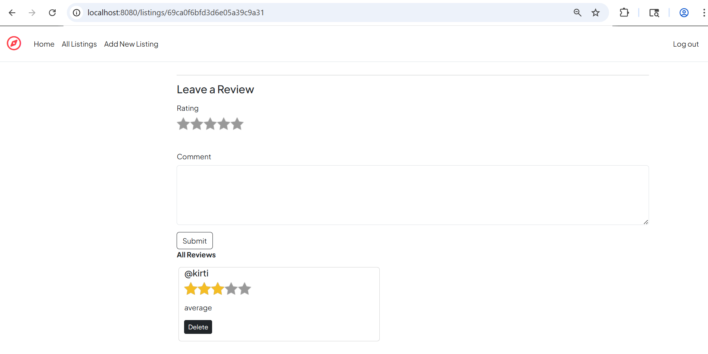
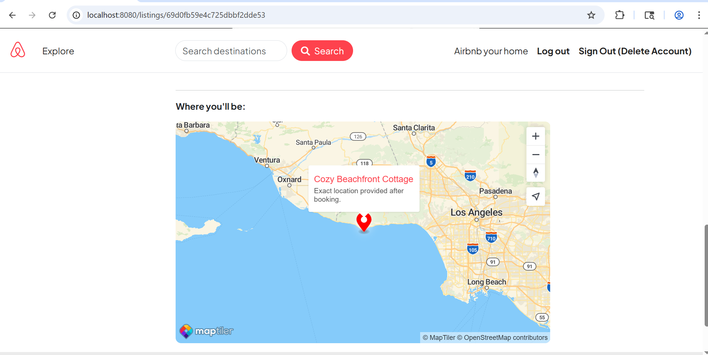
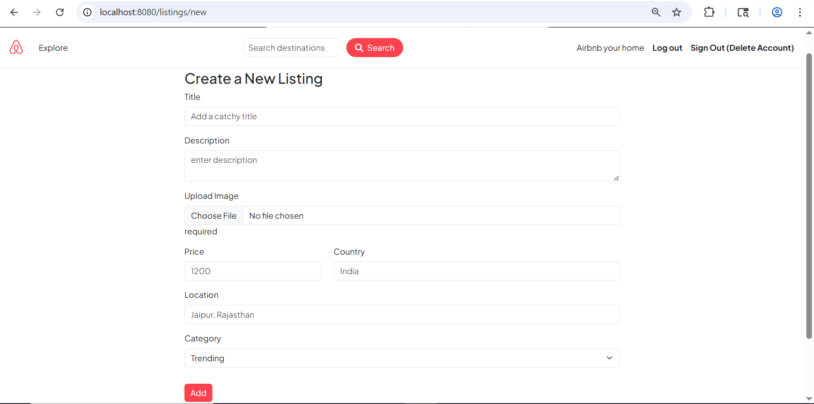
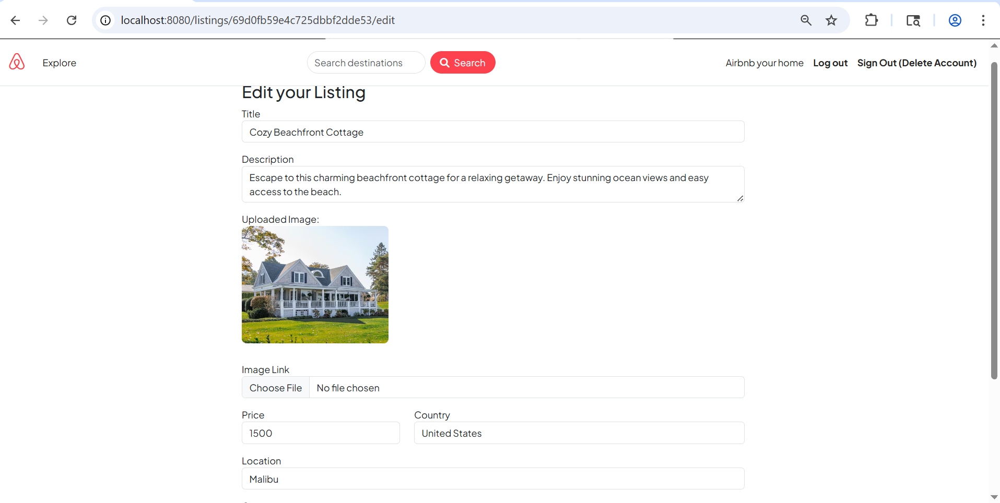
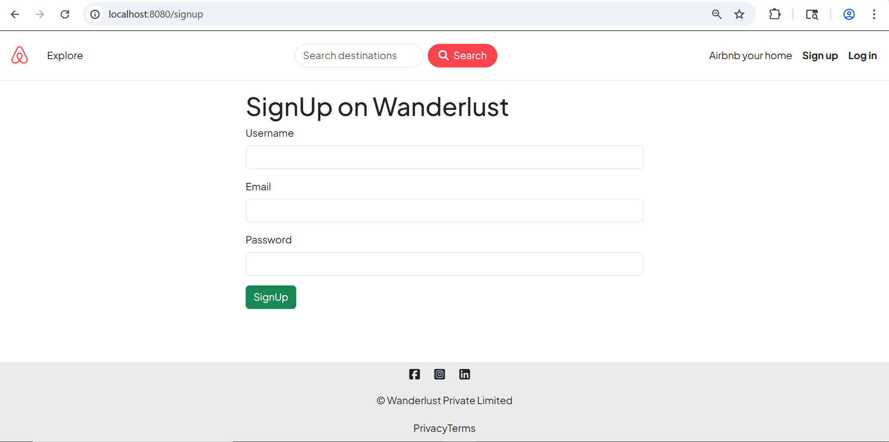
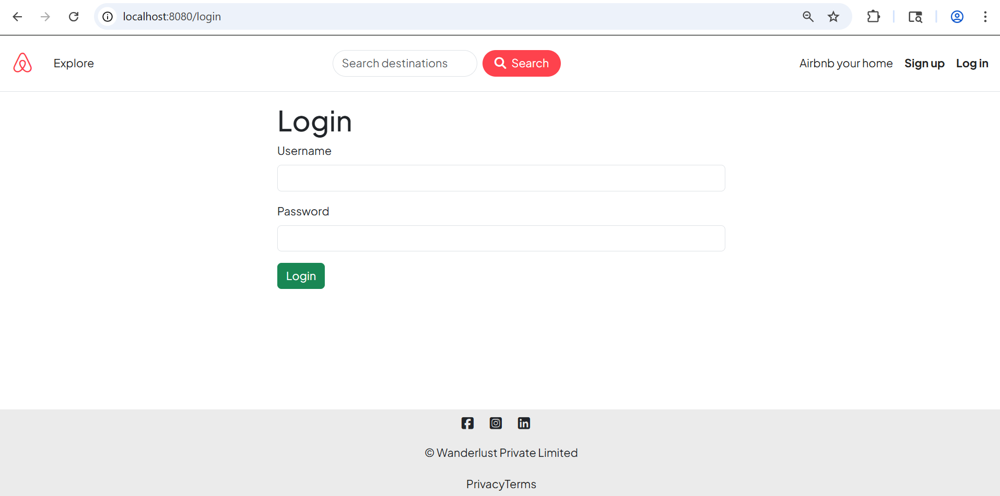
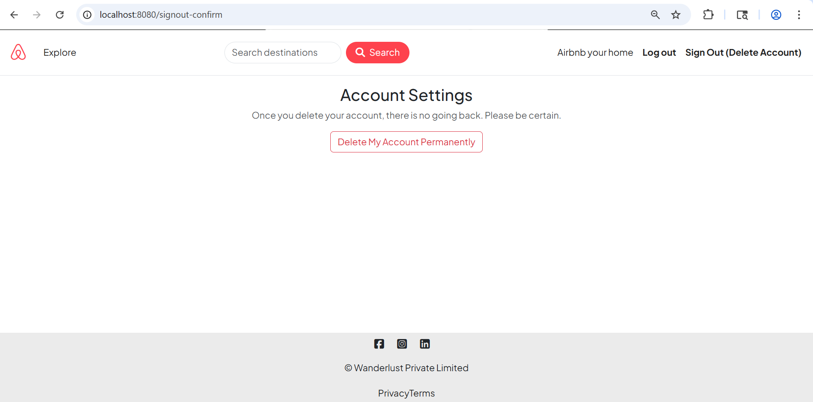
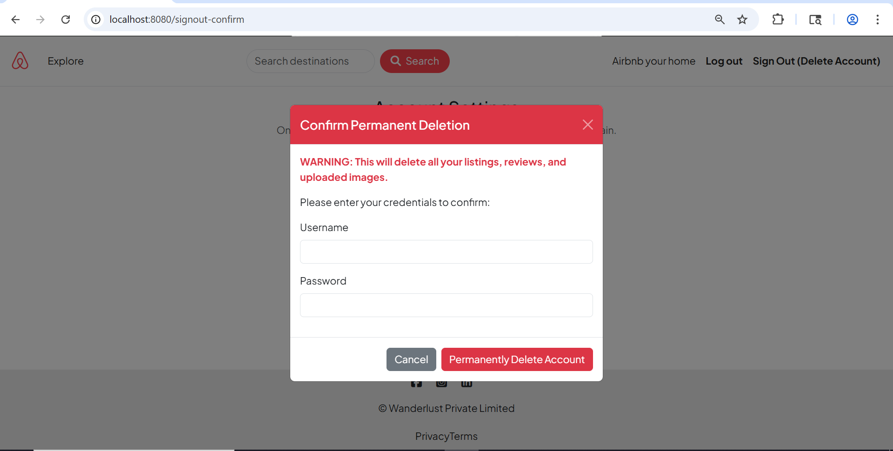

# Wanderlust ✈️  
Wanderlust is a full-stack web application inspired by Airbnb. It allows users to create, explore, and review travel listings. The project follows the **MVC (Model-View-Controller)** architecture for structured and maintainable code.

---

## 🚀 Project Status: Completed & Deployed  

The project is fully functional with authentication, authorization, image uploads, reviews, and map-based location visualization. It is deployed and accessible online.

> Live Link: https://wanderlust-w2pl.onrender.com/listings

### What's been achieved:
- **Full CRUD Functionality** for listings and reviews  
- **Authentication System** with secure sessions  
- **Authorization Controls** for listings and reviews  
- **Cloud-based Image Uploads** using Cloudinary  
- **Geocoding & Map Integration** using MapTiler  
- **Responsive UI** using Bootstrap  
- **MVC Architecture Implementation**  
- **Deployed Application** running in production  

---

## ✨ Features  

### ☁️ Cloud Image Management  
- **Cloudinary Integration** for storing listing images  
- **Multer + Cloudinary Storage** for handling uploads  
- **Edit Form Preview** of existing images  

---

### 🏗️ MVC Architecture  
- Clean separation of concerns:
  - Models (Mongoose schemas)  
  - Views (EJS templates)  
  - Controllers (business logic)  
- Organized routing using Express Router  

---

### 🔐 Authentication & Authorization  
- **User Authentication** using Passport.js  
- Login, Signup, Logout, Signout functionality  
- **Access Control**:
  - Only owners can edit/delete listings  
  - Only authors can delete reviews  
- Middleware:
  - `isLoggedIn`  
  - `isOwner`  
  - `isReviewAuthor`  

---

### 🏠 Listings Management  
- View all listings (index page)  
- Create listings with image upload  
- Detailed show page with:
  - Image  
  - Description  
  - Price  
  - Location map  
- Edit and delete functionality (owner only)  

---

### 💬 Review System  
- Add reviews with rating and comment  
- Reviews linked to listings  
- Only review authors can delete  
- Cascade deletion of reviews when listing is removed  

---

### 🗺️ Map & Geolocation  
- Address converted to coordinates using MapTiler  
- Map displayed on listing show page  
- Location markers for listings  

---

### ✉️ Flash Messages  
- User feedback using connect-flash:
  - Success messages  
  - Error alerts  
  - Authentication feedback  

---

### ✅ Validation  
- Joi schema validation for:
  - Listings  
  - Reviews  
- Prevents invalid or incomplete data submission  

---

## 🛡️ Permissions Matrix  

| Feature   | View | Create | Edit/Update | Delete |
|----------|------|--------|-------------|--------|
| Listings | Public | Registered User | Owner Only | Owner Only |
| Reviews  | Public | Registered User | N/A | Author Only |

---

## 🛠 Tech Stack  

- **Backend**: Node.js, Express.js  
- **Database**: MongoDB, Mongoose  
- **Authentication**: Passport.js  
- **Frontend**: EJS, Bootstrap 5  
- **Image Storage**: Cloudinary  
- **File Uploads**: Multer, multer-storage-cloudinary  
- **Validation**: Joi  
- **Maps & Geocoding**: MapTiler  

---

## 🌐 Deployment  

The application is deployed and running in a production environment.

- **Backend Hosting**: (Add your platform – e.g., Render / Railway)  
- **Database**: MongoDB Atlas  
- **Image Hosting**: Cloudinary  

> Live Link: https://wanderlust-w2pl.onrender.com/listings

## 📸 Screenshots

| Index Page | Show Page |
|------------|-----------|
|  |  |

| Review Page | Map on Show Page |
|------------|------------|
|  |  |

| Create Listing Page | Edit Page |
|------------|-----------|
|  |  |

| Signup Page | Login Page |
|------------|------------|
|  |  |

| Delete Account Page | Confirm Delete Page |
|------------|------------|
|  |  |

---

## ⚙️ Installation & Setup

### 1️⃣ Clone Repository
```bash
git clone https://github.com/techxkirti/Wanderlust.git
cd Wanderlust
```

### 2️⃣ Install Dependencies
```bash
npm install
```

---

### 3️⃣ Environment Variables

Create a `.env` file in the root directory:

```env
CLOUD_NAME=your_cloudinary_name
CLOUD_API_KEY=your_api_key
CLOUD_API_SECRET=your_api_secret

MAPTILER_API_KEY=your_maptile_api_key

SESSION_SECRET=your_secret
```

---

### 4️⃣ Database Setup

Make sure MongoDB is running:

```bash
mongodb://127.0.0.1:27017/wanderlust
```

Seed initial data:

```bash
node init/index.js
```

---

### 5️⃣ Run Application

```bash
node app.js
```

Visit:
```
http://localhost:8080/listings
```