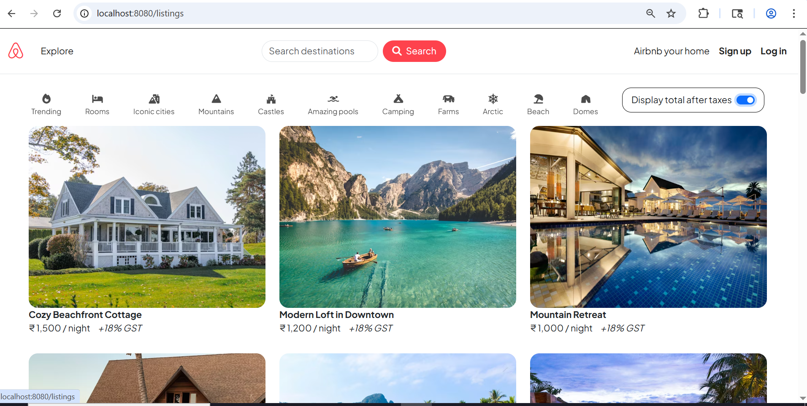
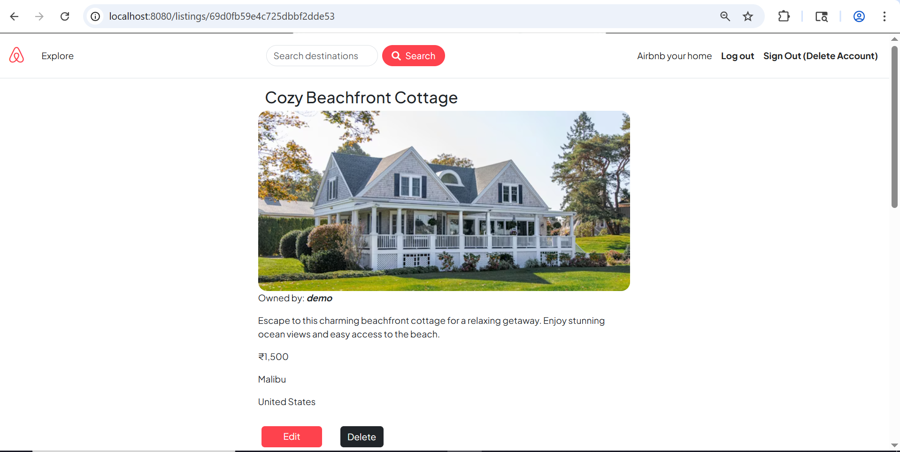

# Wanderlust ✈️

Wanderlust is a full-stack web application inspired by Airbnb. It allows users to list, explore, and review unique travel stays around the world. The project follows the **MVC (Model-View-Controller)** architecture for clean and scalable code.

## 🚀 Current Status: Phase 1 & 2 Complete
The project currently supports full **CRUD** operations for travel listings and a nested **Review System**.

---

## ✨ Features

### 🏠 Listings Management
- **View All Listings**: A responsive home page showing all available stays using Bootstrap cards.
- **Detailed View**: A dedicated show page for each listing with image, description, and pricing.
- **Create & Edit**: Functional forms to add new listings or update existing ones.
- **Smart Image Handling**: Automatic default image fallback if a user provides an empty URL.
- **Currency Formatting**: Prices are automatically formatted to the Indian Rupee (INR) system.

### 💬 Review System
- **Nested Reviews**: Users can leave ratings (1-5 stars) and comments on specific listings.
- **Validation**: Server-side validation for reviews using Joi.
- **Delete Reviews**: Option to remove specific reviews from a listing.

### 🛠 Technical Highlights
- **Schema Validation**: Robust data validation using **Joi** to prevent invalid data from entering the database.
- **Error Handling**: Custom `ExpressError` class and `wrapAsync` utility to handle sync and async errors gracefully.
- **Template Engine**: Used `ejs-mate` for layout partials (Navbar, Footer, Boilerplate) to maintain DRY code.
- **Database Logic**: Implementation of Mongoose middleware to automatically delete all associated reviews when a listing is deleted.

---

## 🛠 Tech Stack

- **Backend**: Node.js, Express.js
- **Database**: MongoDB, Mongoose
- **Frontend**: EJS (Embedded JavaScript), Bootstrap 5, FontAwesome
- **Validation**: Joi (Javascript Object Schema Validation)
- **Styling**: Custom CSS with "Plus Jakarta Sans" typography.

---

## 📸 Screenshots


| Index Page | Show Page |
|------------|-----------|
|  |  |

---

## ⚙️ Installation & Setup

1. **Clone the repo**
   ```bash
   git clone https://github.com/techxkirti/Wanderlust.git
   cd wonderlust
2. **Install Dependencies**
   ```bash
   # This will automatically install all required packages from package.json
   npm install
3. **Database Configuration**
   - Ensure you have **MongoDB** installed and running locally.
   - The app connects to: `mongodb://127.0.0.1:27017/wanderlust`
   - (Optional) To seed the database with initial data:
   ```bash
   node init/index.js
### 5. View the App
- Open your browser and go to: `http://localhost:8080/listings`

---
